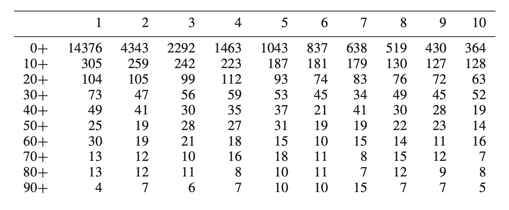
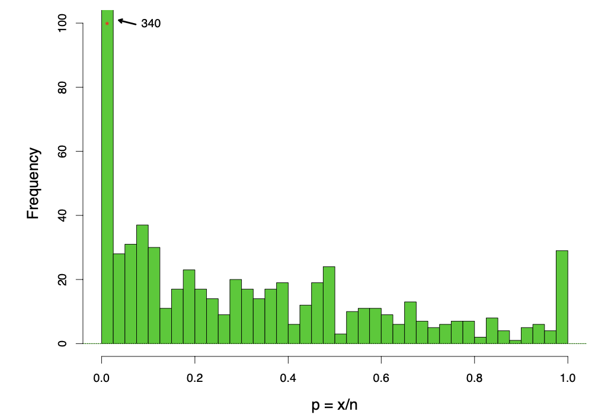

```{r setup, include=FALSE}
knitr::opts_chunk$set(echo = TRUE)
```

# Insurance Claim Example

This example studies one year of claims data for a European automobile insurance company, and the distribution of claim numbers are is shown in the table below. The question of interest is the number of claims each policy holder will make in the next year.

| Number of Claims | Counts |
| :---: | :-----: |
| 0   | 7840 |
| 1         | 1317 |
| 2       | 239 |
| 3      | 42 |
| 4      | 14 |
| 5          | 4 |
| 6       | 4 |
| 7        | 1 |

Suppose that the number of claims made by policy holder k in a year, $x_k$ follows a Poisson distribution with parameter $\theta_k$, 

$$
Pr\{x_k = x\} = p_{\theta_k}(x)=e^{-\theta_k}\theta_k^x/x!,
$$

for x=0,1,2,3... If we knew the prior density $g(\theta)$ for the customers' $\theta$ values, then the Bayes' rule tells us

$$
E\{\theta|x\}=\frac{\int_o^{\infty} \theta p_{\theta}(x)g(\theta)d\theta}{\int_o^{\infty}  p_{\theta}(x)g(\theta)d\theta}
$$

for the expected $\theta$ value of a customer observed to make x claims in a year. This outcome can solve the question of interest about the number of claims to expect the next year from the same customer.

However, what if we don't know the prior $g(\theta)$. We can first rewrite the formula as follow.

$$
E\{\theta|x\} = \frac{\int_o^{\infty}  [e^{-\theta}\theta^{x+1}/x!] g(\theta)d\theta}{\int_o^{\infty}  [e^{-\theta}\theta^{x}/x!] g(\theta)d\theta} = \frac{(x+1)\int_o^{\infty}  [e^{-\theta}\theta^{x+1}/(x+1)!] g(\theta)d\theta}{\int_o^{\infty}  [e^{-\theta}\theta^{x}/x!] g(\theta)d\theta}
$$


Denote the marginal density of x, integrating $p_\theta(x)$ over the prior $g(\theta)$, is

$$
f(x) = \int_0^\infty p_{\theta}(x)g(\theta)d\theta = \int_0^{\infty} [e^{-\theta}\theta^{x}/x!] g(\theta)d\theta
$$
From these two expressions, the Robbins' formula is given

$$
E\{\theta|x\} = (x+1)f(x+1)/f(x)
$$

With Robbins' formula, the desired outcome $E\{\theta|x\}$ can be estimated with no knowledge of the prior density $g(\theta)$. The marginal density $f(x)$ can be estimated by the proportion of total counts in category x.

$$
\hat{f}(x)=y_x/N,\quad N=\sum_x y_x
$$

Therefore, the estimated $E\{\theta|x\}$ can be computed as follow:

```{r}
y = c(7840, 1317, 239, 42, 14, 4, 4, 1)
N = 9461
f_hat = y/N

E = c()
for (i in 1:length(y)-1){
  E[i] = round(i * f_hat[i+1]/f_hat[i],3)
}
E
```


Insert these values into the table, we have


| Number of Claims | Counts | $E\{\theta|x\}$ |
| :------: | :--------: | :--------: |
| 0   | 7840 |       0.168 |
| 1         | 1317 | 0.363 |
| 2       | 239 | 0.527 |
| 3      | 42 | 1.333 |
| 4      | 14 | 1.429 |
| 5          | 4 | 6.000
| 6       | 4 | 1.750 |
| 7        | 1 | |


# Species Discovery Example

In this example, a leading naturalist had been trapping butterflies for two years in Malaysia. The number of trapped species with trapped specimen counts are shown in the table below:

| Number of Species (x) | Specimen Counts (y) | Number of Species (x) | Specimen Counts (y) |
| :---: | :-----: | :---: | :-----: |
| 1   | 118 | 13| 6 |
| 2   | 74 | 14 | 12|
| 3   | 44 | 15 | 6 |
| 4   | 24 | 16 | 9 |
| 5   | 29 | 17 | 9 |
| 6   | 22 | 18 | 6 |
| 7   | 20 | 19 | 10|
| 8   | 19 | 20 | 10|
| 9   | 20 | 21 | 11|
| 10  | 15 | 22 | 5 |
| 11  | 12 | 23 | 3 |
| 12  | 14 | 23 | 3 |

The naturalist asked a seemingly impossible question: if he trapped for one additional year, how many new species would he expect to capture? This question is related to the missing entry of the above table, where the number of species equals to zero, the species that haven't been seen yet. 

Suppose there are S species in total, and $x_k$ denotes the numebr of times species $k$ is trapped in one time unit, follows a Poisson distribution with parameter $\theta_k$

$$
x_k \sim Poi(\theta_k),\quad y_x = \#\{x_k = x\}
$$

Consider a further trapping period of t time units, here for the naturalist t=1/2. Let $x_k(t)$ denotes the number of time species k is trapped in the new period, and assume that

$$
x_k(t) \sim Poi(\theta_k t)
$$

independently of $x_k$.

The probability that a species k is not seen in the initial trapping period bue is seen in the new period is

$$
e^{-\theta_k}(1-e^{-\theta_k t})
$$
Therefore, the expected number of new species seen in the new trapping period, is 

$$
E(t) = \sum_{k=1}^S e^{-\theta_k}(1-e^{-\theta_k t})
$$

It is convenient to rewrite this expression as integral

$$
E(t) = S \int_0^{\infty} e^{-\theta} [\theta t - (\theta t)^2/2! + (\theta t)^3/3! - ...] g(\theta) d\theta
$$
Since the expected value of $y_x$, $e_x$, is the sum of probabilities of being seen exactly x times in the initial period

$$
e_x = E\{y_x\} = \sum_{k=1}^S e^{\theta_k} \theta_k^x/x! = S\int_0^{\infty}[e^{-\theta} \theta^x/x!] g(\theta) d\theta
$$

With the above two expressions, 

$$
E(t) = e_1 t - e_2 t^2 + e_3 t^3 - ...
$$
Using Robbins' formula, the values of $e_x$ can be estimated by $y_x$ values, leading to the estimation below

$$
\hat{E}(t) = y_1 t - y_2 t^2 + y_3 t^3 - ...
$$

$$
\hat{E}(1/2) = 118(1/2) - 74(1/2)^2 + 44(1/2)^3 - ...=45.2
$$


which answers our question of interest that if the naturalist trapped butterflies for one additional year, the estimated number of new species captured is 45.2.

# Shakespeare's vocabulary

In this example, there are 884,647 words in total in the recognized Shakespearean canon, where the number of words with certain word counts is shown in the table below


{width=80%}


Suppose another Shakespeare manuscripts' quantity was discovered, consisting of $884647 \cdot t$ words. The question is: how many previously unseen distinct words would we expect to discover.

If $t=1$, which represents a new canon just as large as the old one. Using the formula derived abov,

$$
\hat{E}(t) = y_1 t - y_2 t^2 + y_3 t^3 - ...
$$
the expected number of distinct new words if $t=1$ is 11430.


# Lymph Node Counts Example

Cancer surgery sometimes considers removing surrounding lymph nodes and the primary target at the site. For $N=844$ surgeries, the number of nodes removed and the number of nodes found positive are denoted as 

$$
n=\# \textrm{nodes removed} \quad \textrm{and} \quad x=\# \textrm{nodes found positive}
$$

and included in the dataset. The positive ratios 

$$
p_k = x_k/n_k
$$

are described in the figure below.

{width=80%}

A large proportion of the ratios were zero, while the rest spreading unevenly between 0 and 1. We assume each patient has some true probability of a node being positive, denoted as $\theta_k$ for patient k, and the patient's node results are independent of each other. Therefore, $x_k$ follows a binomial distribution 

$$
x_k \sum Bi(n_k, \theta_k)
$$
which gives the ratio $p_k = x_k/n_k$ with mean and variance

$$
p_k \sim (\theta_k, \theta_k(1 - \theta_k)/n_k)
$$

so that $\theta_k$ is estimated more accurately with a large $n_k$.

Under a Bayesian analysis, the parameter $\theta_k$ has a prior density $g(\theta)$, which is unknown. However, the parallel nature of the nodes data set suggests an empirical Bayes approach. In the first attempt, we assume that $log\{g(\theta)\}$ is a fourth-degree polynomial in $\theta$

$$
log\{g_{\alpha}(\theta)\}=\alpha_0 + \sum_{j=1}^4 \alpha_j \theta^j
$$

For a given choice of $\alpha$, let $f_{\alpha}(x_k)$ denotes the marginal probability of the observed value $x_k$

$$
f_{\alpha}(x_k)=\int_0^{\infty}\binom{n_k}{x_k} \theta^{x_k}(1-\theta)^{n_k - x_k} g_{\alpha}(\theta)d\theta
$$
and the maximum likelihood estimate of $\alpha$ is the maximizer

$$
\hat{\alpha} = arg max_{\alpha}\{\sum_{k=1}^N log f_{\alpha}(x_k)\}
$$

After obtaining the $\hat{\alpha}$, the prior distribution is determined, and thus the posterior distribution of $\theta_k$ given $x_k$ and $n_k$ can be estimated as 

$$
\hat{g}(\theta|x_k, n_k) = g_{\hat{\alpha}} \binom{n_k}{x_k} \theta^{x_k}(1-\theta)^{n_k - x_k}/f_{\hat{\alpha}}(x_k)
$$


# Discussion and Lessons Learned

These examples are great to understand how empirical Bayes got the chance to develop. The Robbins' formila impresses me the most, with its simplicity and powerfulness. It makes it possible to estimate quantities without actually knowing the prior information. 

From this chapter, I realized that the empirical Bayes approach can solve various kinds of real-world problems and is surprisingly useful. I'm very curious how this approach can help solved problems involving other kinds of probability distributions in other context. For the future study, I'll further explore real-world examples with different distributions using empirical Bayes approach.


